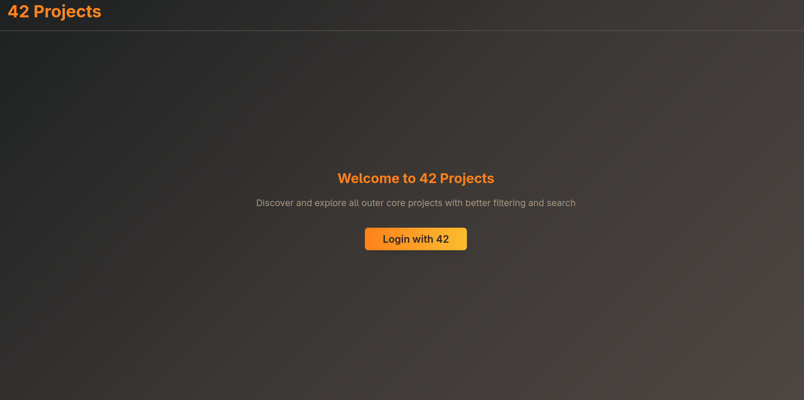
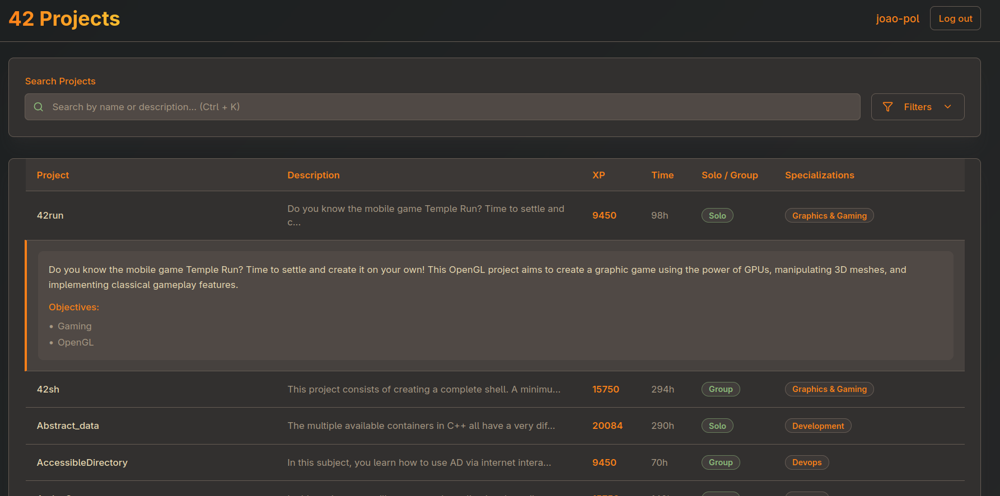
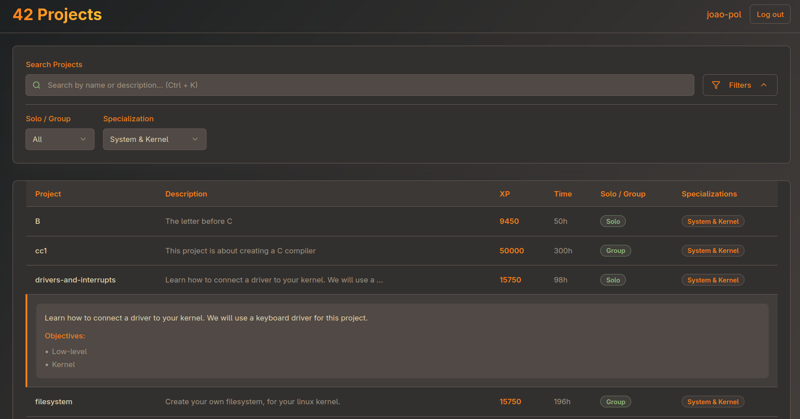

# 42Projects

##### A web application that helps 42 students discover and explore 42 School projects with filtering, searching, and comprehensive project information.

### Visit here! [https://42projects.cc](https://42projects.cc)




## Table of Contents

- [Overview](#overview)
- [Features](#features)
- [For Students](#for-students)
- [Tech Stack](#tech-stack)
- [Contributing](#contributing)
- [License](#license)
- [Support](#support)
- [Roadmap](#roadmap)
- [Changelog](#changelog)

## Overview

42Projects provides a streamlined way to browse outer core and common core projects at 42 School. Instead of navigating through multiple pages on 42's intranet, students can view all projects in one dynamic, filterable table with comprehensive project details.

### What Problem Does It Solve?

- **Information Scattered**: Project information is spread across multiple intranet pages
- **Poor Discoverability**: Hard to find projects matching specific criteria
- **Limited Filtering**: Basic search functionality on the official platform
- **Time Consuming**: Manual navigation through individual project pages

## Features

### Authentication
- Secure 42 OAuth integration
- Session-based authentication

###  Project Discovery
- Browse all common core and outer core projects in one interface
- Dynamic table with sortable columns
- Expandable rows for detailed project information

###  Advanced Filtering & Search
- Filter by programming language (soon..)
- Filter by specialization track
- Filter by project type (solo/group)
- Real-time search by project name or description

###  Comprehensive Project Data
- Project descriptions and objectives
- Estimated completion time
- XP points awarded
- Direct access to project subjects (PDF downloads) (soon..)

###  Modern User Experience
- Gruvbox-inspired dark theme
- Keyboard shortcuts (Ctrl+K for search)
- Fast loading and smooth interactions

## For Students

Whether you're planning your learning path or looking for your next challenge, 42Projects helps you:

- **Discover Projects**: Find projects that match your interests and skill level
- **Plan Your Path**: Understand prerequisites and progression through specializations
- **Save Time**: Access all project information without multiple page visits
- **Make Informed Decisions**: View detailed descriptions and time estimates before starting


## Tech Stack

### Backend
- **Framework**: Django with Django REST Framework
- **Database**: PostgreSQL
- **Authentication**: 42 OAuth integration
- **API**: RESTful API with filtering and pagination

### Frontend
- **Framework**: React with TypeScript
- **Styling**: Tailwind CSS with custom design system
- **State Management**: React hooks and context
- **Build Tool**: Vite

### Infrastructure
- **Containerization**: Docker and Docker Compose
- **Reverse Proxy**: Nginx
- **SSL/CDN**: Cloudflare Tunnel
- **Database**: PostgreSQL

## Contributing

We welcome contributions from the 42 community! This project is built by students, for students.

### How to Contribute

1. **Fork the repository**
2. **Create a feature branch**
   ```bash
   git checkout -b feature/amazing-feature
   ```
3. **Make your changes**
   - Follow the existing code style
   - Update documentation as needed
4. **Commit your changes**
   ```bash
   git commit -m 'Add amazing feature'
   ```
5. **Push to your branch**
   ```bash
   git push origin feature/amazing-feature
   ```
6. **Open a Pull Request**

### Development Guidelines

- **Code Style**: Follow PEP 8 for Python, ESLint rules for TypeScript
- **Documentation**: Update README and inline comments
- **Commits**: Use conventional commit messages
- **Issues**: Check existing issues before creating new ones

### What We're Looking For

- Bug fixes and improvements
- New features that benefit 42 students
- Documentation improvements
- UI/UX enhancements
- Performance optimizations


## License

This project is licensed under the MIT License - see the [LICENSE](./LICENSE) file for details.

## Support

### Reporting Issues

Found a bug or have a feature request? Please check our [GitHub Issues](https://github.com/yourusername/42projects/issues) page:

1. Search existing issues to avoid duplicates
2. Use the provided issue templates
3. Include detailed steps to reproduce bugs
4. Attach screenshots when helpful

### Getting Help

- **Documentation**: Check this README and inline code comments
- **Issues**: Open a GitHub issue for bugs or feature requests
- **Community**: Engage with other contributors in issue discussions

## Roadmap

### Phase 1 - Core MVP ✅
- [x] Backend API with Django REST Framework
- [x] Frontend with React and TypeScript
- [x] 42 OAuth authentication
- [x] Project filtering and search
- [x] Responsive design
- [x] Production deployment

### Phase 2 - Enhanced User Experience
- [ ] Add language to filters (need to manually add into each one)
- [ ] Subject download field
- [ ] Project bookmarking system
- [ ] Data Enhancement
    - [ ] Organize piscine subjects
- [ ] Performance optimizations
- [ ] Multi-language support

### Phase 3 - Community Features
- [ ] Student project reviews and ratings
- [ ] Help check with RCNP's progression (inspired from [here](https://rncp.hacku.org/login))

### Phase 4 - Advanced Features
- [ ] Mobile application
- [ ] Offline functionality

## Changelog

### [1.0.0] - 2025-09-08

#### Initial Release
- **Authentication**: 42 OAuth integration with secure session management
- **Project Database**: Complete integration with 42 API for project data
- **Search & Filter**: Advanced filtering by language, specialization, and project type
- **User Interface**: Modern responsive design with Gruvbox theme
- **Project Details**: Comprehensive project information with expandable descriptions
- **Performance**: Optimized API endpoints with efficient data loading

#### Features
- Real-time project search functionality
- Sortable table columns (name, XP, time, type)
- Persistent filter preferences using local storage
- Keyboard shortcuts for improved accessibility

#### Known Issues
- Piscine projects are scattered and are difficult to read and understand (I know)
 - This will be done in Milestone 2, when I will try to group those projects
- The design isn't the most responsive (especially on mobile)

---

**Built with ❤️ for the 42 community**
